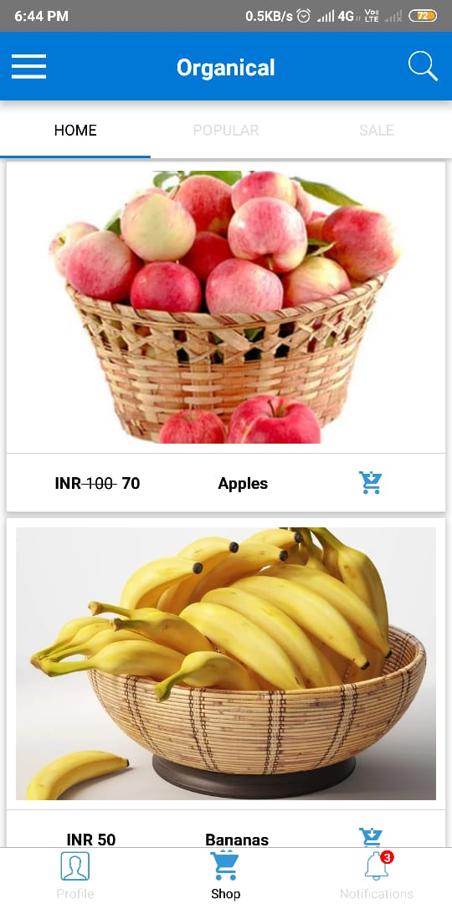
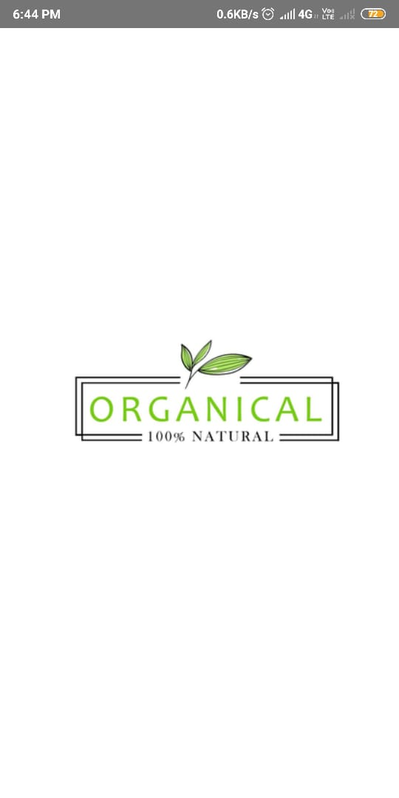
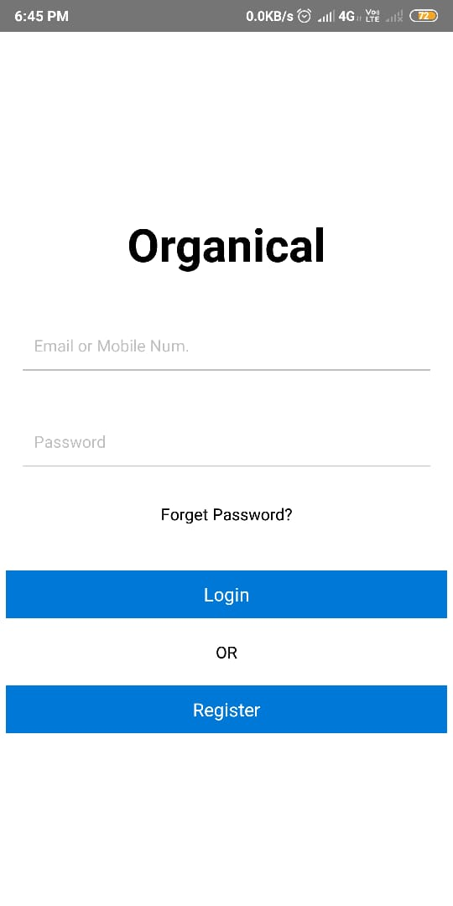
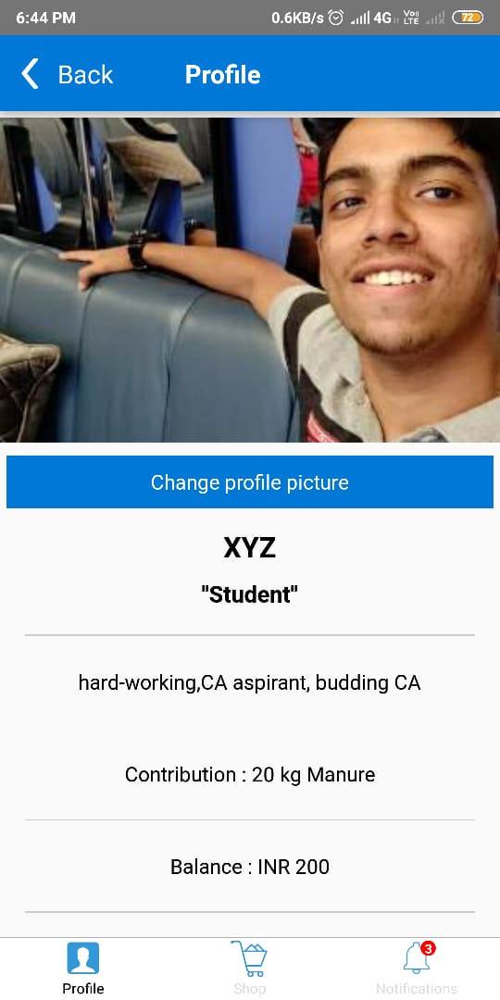
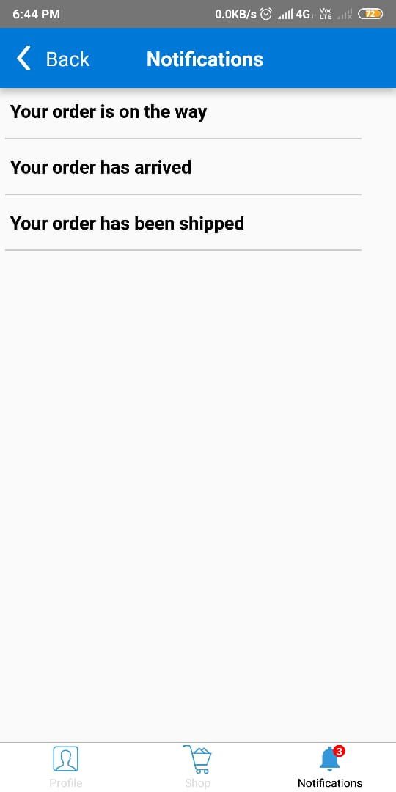
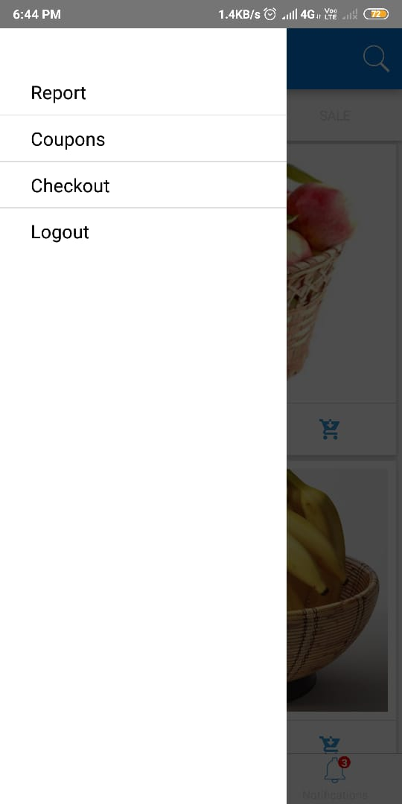
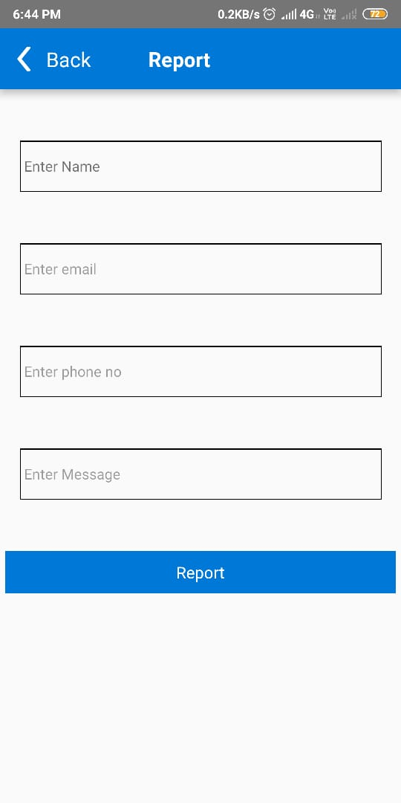
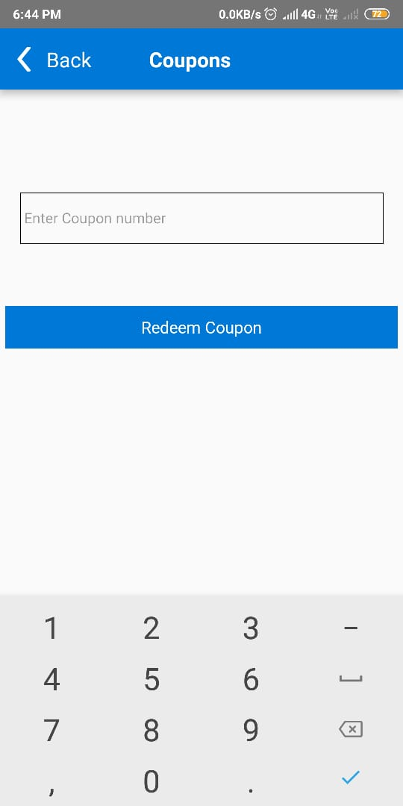
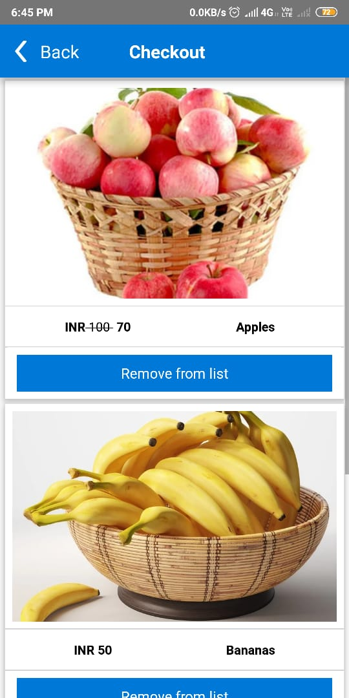

<!-- PROJECT LOGO -->
<br />
<p align="center">
  <a href="https://github.com/othneildrew/Best-README-Template">
    
  </a>

  <h3 align="center">Organical - Shop natural</h3>

  <p align="center">
    An ecommerce app
    <br />
    <a href="https://github.com/ram2510/Organical"><strong>Explore the docs »</strong></a>
    <br />
    <br />
    <a href="https://github.com/ram2510/Organical">View Demo</a>
    ·
    <a href="https://github.com/ram2510/Organical/issues">Report Bug</a>
    ·
    <a href="https://github.com/ram2510/Organical/issues">Request Feature</a>
  </p>
</p>


<!-- TABLE OF CONTENTS -->
## Table of Contents

- [Table of Contents](#table-of-contents)
- [About The Project](#about-the-project)
  - [Built With](#built-with)
- [Getting Started](#getting-started)
  - [Prerequisites](#prerequisites)
- [Features](#features)
- [Contributing](#contributing)
- [License](#license)


<!-- ABOUT THE PROJECT -->
## About The Project



The main idea of this product is as follows - 
- The team will be reaching out to farmers and requesting them to lend thier fruits in return of organic manure so that both sides benfit from it.
- The team will be also reaching out to societies for cleaning their surroundings. From the trash we will be generating the manure which will be given to the farmers. In return for the permission to clean thier surroundings we will be giving them coupons which they can reedeem to shop in the app
- We will be listing out the products given to us by the farmers in the app for users to buy with occasional sales

> Note the data in the app is hard code and you can find the products data in the data directory so I have coded in a way which can be easily replacable with an api call

### Built With

* [react-native](https://facebook.github.io/react-native/)


<!-- GETTING STARTED -->
## Getting Started

1. Clone the repo 
2. Install all the packages in the package.json file and follow the instructions mentioned on thier readme pages for correctly installing them
3. Run the command   To start the app in development server
  ```
  react-native run android
  ```


3. For building the production apk navigate to the root directory and run    To bundle the assets

  ```
  react-native bundle --platform android --dev false --entry-file index.js \
  --bundle-output android/app/src/main/assets/index.android.bundle \
  --assets-dest android/app/src/main/res/
  ```

4. Then navigate to the android directory and run the command
  ```
  ./gradlew assembleRelease -x bundleReleaseJsAndAssets 
  ```
5. Now you can find the release apk in `android/app/build/outputs/apk/release`

### Prerequisites
1. Install react-native


<!-- USAGE EXAMPLES -->
## Features
1. When you first open the app you will see the splash screen
  


2. If you have not previously logged in the app you will be directed to the login screen
   


The hardcoded correct username and pass word is `username - testuser` `password - pass12`

3. If you have been logged in you will be directed towards the main screen which consists of 
   - Home screen (Shop) here you can see all the listed products in the shop. They are divided into 3 parts Home
     - Home Here you can find all the products
     - Products Here you can find all the products ranked accoridng to thier popularity
     - Sale Here you will find products that are on Sale
  


   - Profile Here you can display the user information (Note when you first install the app the profile would be empty you would have to change it)
  


   - Notifications here you can display the notifications regarding a users order 



4. This app consists of a slide menu which have the following screens



  - Report Here the societies can report the team to collect the garbage 



  - Coupons Here the users can reedeem the coupons code to get cashback



  - Checkout here users can confirm thier order




<!-- CONTRIBUTING -->
## Contributing

Contributions are what make the open source community such an amazing place to be learn, inspire, and create. Any contributions you make are **greatly appreciated**.

1. Fork the Project
2. Create your Feature Branch (`git checkout -b feature/AmazingFeature`)
3. Commit your Changes (`git commit -m 'Add some AmazingFeature'`)
4. Push to the Branch (`git push origin feature/AmazingFeature`)
5. Open a Pull Request


<!-- LICENSE -->
## License

Distributed under the MIT License. See `LICENSE` for more information.


 [](https://www.linkedin.com/in/ram2510) [](https://www.github.com/ram2510) 